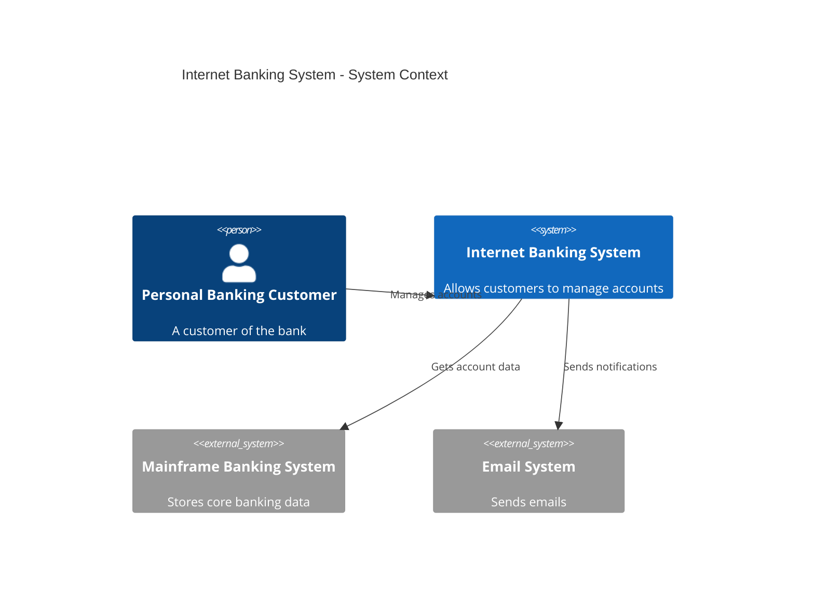
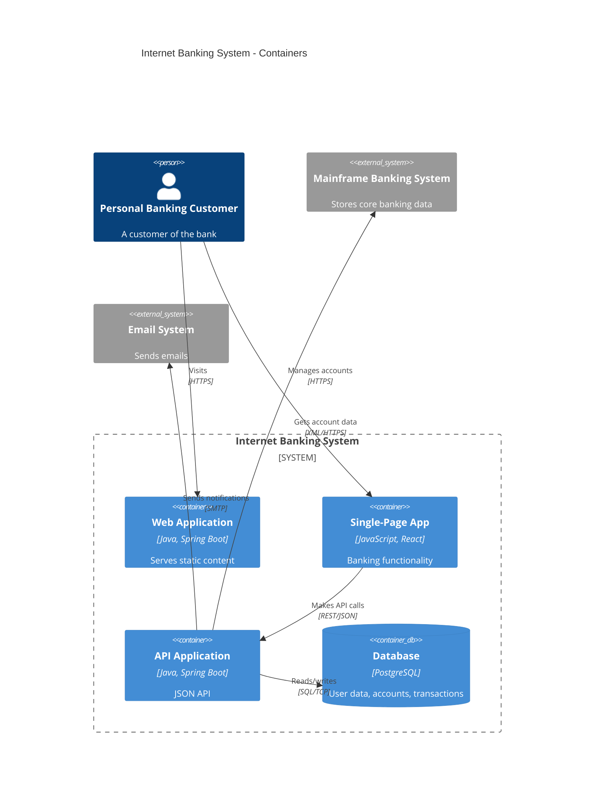

# Mermaid C4 Diagrams

Source: https://mermaid.js.org/syntax/c4.html

Mermaid's C4 support is experimental — syntax may change. Good for embedding diagrams in markdown that renders on GitHub, GitLab, or documentation sites.

## Contents
- Diagram Types — C4Context, C4Container, C4Component, C4Dynamic, C4Deployment
- Elements — people, systems, containers, components, deployment nodes
- Boundaries — grouping elements
- Relationships — connecting elements with optional direction hints
- Styling — element and relationship appearance
- Complete Examples — system context and container diagrams
- Limitations

## Diagram Types

Start a diagram with the type keyword:
- `C4Context` — System Context
- `C4Container` — Container
- `C4Component` — Component
- `C4Dynamic` — Dynamic (runtime interactions)
- `C4Deployment` — Deployment

## Elements

### People
```
Person(alias, "Label", "Description")
Person_Ext(alias, "Label", "Description")
```

### Software Systems
```
System(alias, "Label", "Description")
System_Ext(alias, "Label", "Description")
SystemDb(alias, "Label", "Description")
SystemQueue(alias, "Label", "Description")
```
`_Ext` variants for external systems. `Db` and `Queue` variants for visual shape.

### Containers
```
Container(alias, "Label", "Technology", "Description")
ContainerDb(alias, "Label", "Technology", "Description")
ContainerQueue(alias, "Label", "Technology", "Description")
Container_Ext(alias, "Label", "Technology", "Description")
```

### Components
```
Component(alias, "Label", "Technology", "Description")
ComponentDb(alias, "Label", "Technology", "Description")
ComponentQueue(alias, "Label", "Technology", "Description")
```

### Deployment Nodes
```
Deployment_Node(alias, "Label", "Type", "Description")
Node(alias, "Label", "Type", "Description")
```

## Boundaries

Group elements with boundaries:
```
Boundary(alias, "Label", "Type") {
    Container(...)
    Container(...)
}

System_Boundary(alias, "Label") {
    Container(...)
}

Enterprise_Boundary(alias, "Label") {
    System(...)
}

Container_Boundary(alias, "Label") {
    Component(...)
}
```

## Relationships

```
Rel(from, to, "Label", "Technology")
Rel(from, to, "Label")
BiRel(from, to, "Label")
```

Directional hints for layout:
```
Rel_U(from, to, "Label")    %% upward
Rel_D(from, to, "Label")    %% downward
Rel_L(from, to, "Label")    %% leftward
Rel_R(from, to, "Label")    %% rightward
Rel_Back(from, to, "Label") %% backward
```

For dynamic diagrams, use indexed relationships:
```
RelIndex(1, from, to, "Label")
RelIndex(2, from, to, "Label")
```

## Styling

```
UpdateElementStyle(alias, $bgColor="blue", $fontColor="white", $borderColor="black")
UpdateRelStyle(from, to, $textColor="red", $lineColor="blue", $offsetX="-40", $offsetY="60")
UpdateLayoutConfig($c4ShapeInRow="3", $c4BoundaryInRow="1")
```

## Complete Example — System Context



## Complete Example — Container



## Limitations
- Layout is controlled by statement order and directional hints, not auto-layout algorithms
- Fixed visual styling — limited CSS customization
- Sprites, tags, and links are not fully supported
